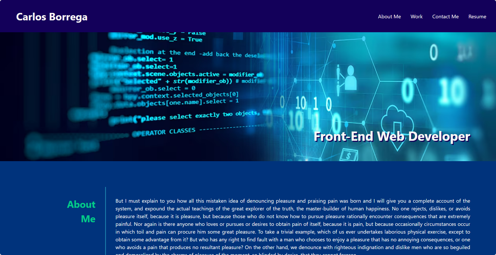

# Carlos Borrega Portfolio Website

## Description 

The Carlos Borrega Portfolio Website consists in building a portfolio website entirely from scratch. Using HTML and CSS as the primary technologies, the project's main objective is to create a visually appealing and responsive website by implementing key features such as Flexbox, CSS variables, and media queries.




## Deployment

The deployed version of the Caros Borrega Portfolio Website can be accessed [here](https://borregaio.github.io/special-system/).


## Key Objectives

1. **Flexbox Layout:** Utilize Flexbox to create a flexible and efficient layout, ensuring a visually pleasing design that adapts seamlessly to different screen sizes.

2. **CSS Variables:** Implement CSS variables to enhance customization and maintainability, allowing for easy adjustments and updates to the website's styling.

3. **Media Queries:** Incorporate media queries to optimize the website's responsiveness on tablets and mobile phones, providing an optimal viewing experience across various devices.


## Installation

### Clone the repository
```console
git clone https://github.com/borregaio/special-system.git
```

### Navigate to the project directory
```console
cd special-system
```

### Open with VSCode
```console
code .
```

## Steps Followed to Create the Website

1. **HTML Structure:**
   - Develop the HTML structure, focusing on creating sections for different aspects of the portfolio, such as skills, projects, and contact information.

2. **CSS Styling with Flexbox:**
   - Implement Flexbox to create a flexible and efficient layout for the portfolio.
   - Style each section with CSS to achieve the desired visual design.

3. **Integrating CSS Variables:**
   - Utilize CSS variables to centralize styling parameters, allowing for easy customization and maintenance.

4. **Media Queries for Responsiveness:**
   - Implement media queries to ensure the website is responsive on tablets and mobile phones.
   - Test and adjust the layout for different screen sizes.

